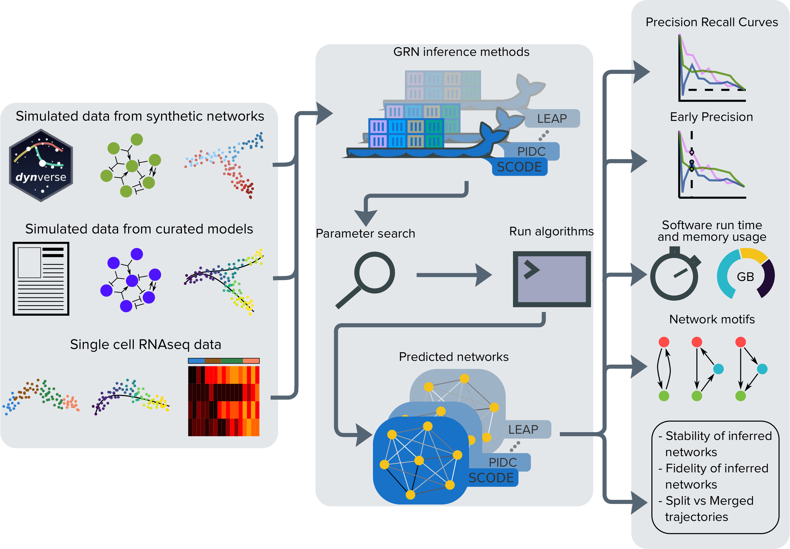

# :honeybee: BEELINE: Benchmarking gEnE reguLatory network Inference from siNgle-cEll transcriptomic data :honeybee:

This is the main repository for BEELINE. The documentation is available at: [https://murali-group.github.io/Beeline/](https://murali-group.github.io/Beeline/).

Quick setup:
- To install docker on Ubuntu 18.04, follow the steps mentioned [here](https://www.digitalocean.com/community/tutorials/how-to-install-and-use-docker-on-ubuntu-18-04)
- Setup docker to run docker without sudo using ` sudo usermod -aG docker $USER`, if you haven't already. See more details [here](https://askubuntu.com/questions/477551/how-can-i-use-docker-without-sudo)
- To create the docker containers for each of the algorithms run `. initialize.sh` (this step will take a while)
- We recommend using [Anaconda](https://www.anaconda.com/) for Python. Run the `. setupAnacondaVENV.sh` command to automatically create an Anaconda virtual environment named BEELINE from requirements.txt and install necessary libraries required to run BEELINE. Alternatively, you can create virtual environment for python using vnev from requirements.txt as detailed [here](https://packaging.python.org/guides/installing-using-pip-and-virtual-environments/)

We provided an example dataset under inputs/example/GSD/ and a corresponding configuration file necessary for running GRN inference using 12 methods described in BEELINE. 
- To compute proposed reconstructions on the example dataset, run `python BLRunner.py --config config-files/config.yaml`
- To compute areas under the ROC and PR curves for the proposed reconstructions, run `python BLEvaluator.py --config config-files/config.yaml --auc`. To display the complete list of evalutation options, run `python BLEvaluator.py --help`.

If you use BEELINE in your research, please cite:

Pratapa, A., Jalihal, A.P., Law, J.N., Bharadwaj, A., Murali, T. M. (2020) "Benchmarking algorithms for gene regulatory network inference from single-cell transcriptomic data." _Nature Methods_, 17, 147–154.

Link to the pubication: [https://www.nature.com/articles/s41592-019-0690-6](https://www.nature.com/articles/s41592-019-0690-6)

The preprint version of this article is available at: [https://doi.org/10.1101/642926](https://doi.org/10.1101/642926)

The repository for BoolODE is located at: [https://github.com/Murali-group/BoolODE](https://github.com/Murali-group/BoolODE)

The input datasets used in BEELINE are available at: [https://doi.org/10.5281/zenodo.3378975](https://doi.org/10.5281/zenodo.3378975)

Twitter thread link: https://twitter.com/t_m_murali/status/1215302095601119234?s=20
