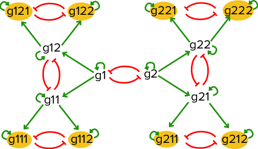
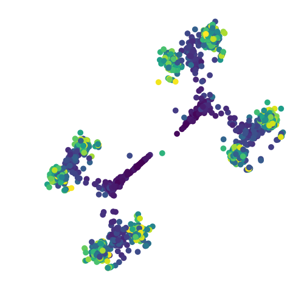

Defining an input model
#######################

Consider a toy gene regulatory network with a series of mutual
inhibition motifs as illustrated below:

   If there is an equal probabiliy of taking either the left hand branch
   or the right hand branch starting at (g1=high,g2=high), this network will
   result in 8 distinct steady states, with one of the eight extreme genes being
   active in each steady state.

BoolODE can be used to generate gene expression data of a sample of cells undergoing
a developmental process controlled by a gene regulatory network with a wiring diagram
as shown above.

The above network diagram can be represented as a Boolean model as follows:
   
.. code:: text
          
          Gene	Rule
          g1	( g1 ) and not ( g2 )
          g2	( g2 ) and not ( g1 )
          g11	( g1 or g11 ) and not ( g12 )
          g12	( g1 or g12 ) and not ( g11 )
          g21	( g2 or g21 ) and not ( g22 )
          g22	( g2 or g22 ) and not ( g21 )
          g111	( g11 or g111 ) and not ( g112 )
          g112	( g11 or g112 ) and not ( g111 )
          g121	( g12 or g121 ) and not ( g122 )
          g122	( g12 or g122 ) and not ( g121 )
          g211	( g21 or g211 ) and not ( g212 )
          g212	( g21 or g212 ) and not ( g211 )
          g221	( g22 or g221 ) and not ( g222 )
          g222	( g22 or g222 ) and not ( g221 )

In order to test BoolODE, copy the rules  above into a file, say ``multistate.txt``,
in the ``/data`` folder in the BoolODE folder.

.. note:: BoolODE expects a tab separated rule file! Make sure the
           input file has tabs between the ``Gene`` and ``Rule`` column.
          
Notice that the ``g1<->g2`` interaction is central to the behavior of
the model.  Let us choose an initial condition such that these genes
have a medium/high value. Biologically, this can be interpreted as the
initial undifferentiated cells have genes ``g1`` and ``g2`` 'ON', and
all other genes 'OFF'.  We can specify this initial state by creating a file with the
following lines:

.. code:: text

          Genes	Values
          ['g1','g2']	[1,1]

The first column takes a list of genes formatted like a python list of
strings. The second column takes a list of values to assign to the
list of genes, again formatted as a python list of values. **Any gene not
listed in this file will be assigned an initial value of 0 by default.**

Let us save the initial condition specification in
``/data/multistate_ics.txt``.

.. note:: The initial condition file should also be tab
           separated. Also, pay attention to the capitalization
           of the column names.

.. tip:: We recommend starting off with initial condition values
         between 0 and 2, since larger values might cause numerical
         instability.

Running BoolODE
###############

A few more decisions before we get our simulated dataset of gene expression
values:

1. How long do you want to simulate this model? Let's choose 8 time units
2. How many cells do you want to simulate? 2000 seems like a good number.
3. Where would you like to store the simulation output? Say, ``./test/``. BoolODE will create any folders that don't already exist.   
4. Do you want to speed up the simulations by running simulations in parallel? Yes!

One last option that we will add is ``--sample-cells``, which will instruct BoolODE
to sample one cell from each simulated trajectory.

This is all we need to call BoolODE on this model! The following
directive puts together all the information collected so far

.. code:: bash

   python src/BoolODE.py --path data/multistate.txt \    # path to the Boolean rules file
                         --ics data/multistate_ics.txt \ # path to initial condition specification
                         --max-time 8 \                  # maximum time of simulation
                         --num-cells 2000 \              # number of cells/simulations to perform
                         --outPrefix test/ \             # relative path to destination
                         --do-parallel \                 # do parallel simulations
                         --sample-cells                  # sample one cell from each simulation

For a full list of available options, see :ref:`boolodeoptions`

Working with BoolODE output
###########################

The simulations will take about 5 minutes to complete. At the end of a successful run, the
output directory should like this:

.. code:: text

          test/                      # User specified destination
          |-- parameters.txt         # Parameter names and values generated for input model
          |-- ExpressionData.csv     # Gene expression dataset
          |-- PseudoTime.csv         # Simulation time of each sample time point/cell
          |-- refNetwork.csv         # Boolean network represented as an edge list, the ground truth network
          `-- simulations/
              |-- E1.csv
              |-- E2.csv
              ...

Where ``E1.csv, E2.csv, ...`` are individual simulations. Each column in these
files, the cell IDs, has the form ``E<simulation number>_<timepoint>``.
          
.. note:: By default BoolODE will store the entire simulated time
          course for every simulation. Specifying the ``--sample-cells``
          option will result in BoolODE sampling cells and creating an
          ``ExpressionData.csv`` file with genes as rows, and cells as columns.
          If the option is not specified, you can write a custom script to
          sample cells from each simulation

In order to visualize the entire dataset, we can carry out dimensionality reduction using
t-SNE. A script like the one below is a good starting point for this.

.. code:: python

          import pandas as pd
          from sklearn.manifold import TSNE
          import matplotlib
          import matplotlib.pyplot as plt
          
          def vis(df, p):
              tsne = TSNE(n_components=2,perplexity=p).fit_transform(df.T.values)
              tdf = pd.DataFrame(tsne, columns=['t-SNE 1', 't-SNE 2'],index=df.columns)
              tdf.to_csv('test/tsne.csv')
              fig, ax = plt.subplots(1,1,figsize=(5,5))
              ax.scatter(tsne[:,0], tsne[:,1], c = [float(col.split('_')[1]) for col in df.columns])
              ax.axis('off')
              plt.tight_layout()
              plt.savefig('test/tree.png')
              
          df=pd.read_csv('test/ExpressionData.csv', index_col=0)
          vis(df, 400)
          
Here, the time point of each cell is inferred from the cell ID, and this information
is used to color each cell in the scatter plot. Darker colors imply early time points in the
simulation. The output should look like the following

   t-SNE visualization of BoolODE output
           
Notice the eight steady state clusters! This dataset can now be
processed further using the tools described in  :ref:`geninputs` to produce
input datasets for the BEELINE pipeline.
            
