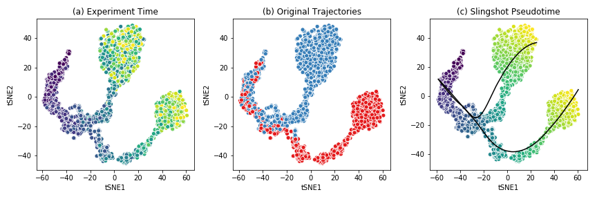

This tutorial will first explain the structure of the BEELINE repository,
with a walkthrough of the different components that the user can customize.

Project outline
###############

The BEELINE repository is structured as follows:

.. code:: text

          BEELINE
          |-- inputs/
          |-- config-files/
          |   `-- config.yaml
          |-- BLRun/
          |   |-- runner.py
          |   |-- sinceritiesRunner.py
          |   `-- ...
          |-- BLPlot/
          |   |-- plotter.py
          |   |-- PlotAUPRC.py
          |   |-- PlotAUROC.py
          |   |-- PlotEPR.py
          |   `-- ...
          |-- BLEval/
          |   |-- evaluator.py
          |   |-- BLTime.py
          |   `-- ...
          |-- Algorithms/
          |     |-- SINCERITIES/
          |     `-- ...
          |-- utils/
          |   |-- initialize.sh
          |   `-- setupAnacondaVENV.sh
          |-- LICENSE
          |-- BLRunner.py
          |-- BLEvaluator.py
          `-- README.md

.. _input-datasets:

Input Datasets
##############

The sample input data set provided is generated by :ref:`BoolODE`
using the Boolean model of `Gonadal Sex Determination
<https://www.ncbi.nlm.nih.gov/pubmed/26573569>`_ as input.  Note that
this dataset has been pre-processed to produce three files that are
required in the BEELINE pipeline.

1. `ExpressionData.csv` contains the RNAseq data, with genes as
   rows and cell IDs as columns. This file is a required input to the
   pipeline. Here is a `sample ExpressionData.csv file <https://github.com/Murali-group/Beeline/blob/master/inputs/example/GSD/ExpressionData.csv>`_
2. `PseudoTime.csv` contains the pseudotime values for the cells in
   `ExpressionData.csv`.  We recommend using the Slingshot method to
   obtain the pseudotime for a dataset. Many algorithms in the
   pipeline require a pseudotime file as input. Here is a `sample
   PseudoTime file
   <https://github.com/Murali-group/Beeline/blob/master/inputs/example/GSD/PseudoTime.csv>`_.
3. `GroundTruthNetwork.csv` contains the ground truth network underlying the
   interactions between genes in `ExpressionData.csv`. Typically this
   network is not available, and will have to be curated from various
   Transcription Factor databases. While this file is not a
   requirement to run the base pipeline, a reference network is
   required to run some of the performance evaluations in
   :ref:`BLEval`.  Here is a `sample GroundTruthNetwork.csv file
   <https://github.com/Murali-group/Beeline/blob/master/inputs/example/GSD/GroundTruthNetwork.csv>`_

The figure below shows the t-SNE visualization of the expression
data from the example dataset.

This dataset shows a bifurcating
trajectory, as is evidenced by the part (a) of the figure, where
each 'cell' is colored by the timepoint at which it was sampled
in the simulation (the darker colors indicate earlier time points).
Clustering the simulation confirms the two trajectories, indicated
in red and blue respectively in part (b). Finally, running Slingshot
on this dataset and specifying the cluster of cells corresponding to
the early time points yields two pseudotime trajectories, shown in part (c).
For details on the generation of this simulated dataset, see :ref:`boolode`.

.. attention:: Please ensure that any input dataset you create is
               comma separated, and contains the correct style of
               column names.

.. _configfiles:

Config files
############

Beeline uses `YAML <https://yaml.org/>`_ files to allow users to
flexibly specify inputs and algorithm run parameters. A sample config
file is provided `here
<https://github.com/Murali-group/Beeline/blob/master/config-files/config.yaml>`_. A
config file should contain at minimum

.. code:: text

          input_settings:
              input_dir : "Base input directory (recommended: inputs)"
              datasets:
                  - dataset_id: "Dataset group label"
                    should_run: [True]
                    groundTruthNetwork: "Ground truth network filename"
                    runs:
                        - run_id: "Run subdirectory name"
              algorithms:
                  - algorithm_id: "Algorithm name"
                    image: "Docker image tag"
                    should_run: [True]  # or [False]
                    params:
                        # Any algorithm-specific parameters

          output_settings:
              output_dir : "Base output directory (recommended: outputs)"

Apart from indicating the path to the base input directory, the config file
specifies which datasets and runs to process, which algorithms should be run,
and the parameters to pass to each algorithm. For a list of parameters
that the pipeline currently supports, see :ref:`algorithms`. The config
also specifies ``output_dir``, where all outputs are written.

The ``datasets`` list groups runs that share the same ground truth network
under a common ``dataset_id``. Each ``run_id`` corresponds to a
subdirectory of ``input_dir/dataset_id/`` containing the expression,
pseudotime, and ground truth files for that replicate.

For example, if the config file contains:

.. code:: text

          input_settings:
              input_dir : "inputs"
              datasets:
                  - dataset_id: "GSD"
                    should_run: [True]
                    groundTruthNetwork: "GroundTruthNetwork.csv"
                    runs:
                        - run_id: "GSD-1"
              algorithms:
                  - algorithm_id: "PIDC"
                    image: "grnbeeline/pidc:base"
                    should_run: [True]
                    params: {}
                  - algorithm_id: "SCODE"
                    image: "grnbeeline/scode:base"
                    should_run: [False]
                    params:
                        z: [10]
                        nIter: [1000]
                        nRep: [6]

          output_settings:
              output_dir : "outputs"

BEELINE would interpret this as follows:

- The input files for run ``GSD-1`` are located at ``inputs/GSD/GSD-1/``, e.g.
  ``inputs/GSD/GSD-1/ExpressionData.csv``. The ground truth network is read
  from ``inputs/GSD/GSD-1/GroundTruthNetwork.csv``.
- SCODE will be skipped because ``should_run`` is set to ``[False]``.
- Outputs for each algorithm are written under
  ``outputs/GSD/GSD-1/<algorithm_id>/``. For example, PIDC results will
  be at ``outputs/GSD/GSD-1/PIDC/rankedEdges.csv``.

.. attention:: Please ensure that the YAML file is correctly indented!

Running the pipeline
####################

Once the input dataset has been generated and formatted as described
in Section :ref:`input-datasets`, and the config file has been
created as described in :ref:`configfiles`, the pipeline can be
executed by calling ``BLRunner.py`` with the config file
passed using the ``--config`` option.

To run the pipeline, simply invoke

.. code:: bash

          python BLRunner.py --config PATH/TO/CONFIG/FILE

For details about the implementation of :class:`BLRun`, see :ref:`blrunguide`.

Running the evaluation scripts
##############################

Each algorithm outputs an inferred network in the form of a ranked edge list.
BEELINE implements a consistent interface using the config file in order to retrieve
the predictions of multiple algorithms and evaluate them using a variety of methods.

The evaluation of the inferred networks is done by calling the
``BLEvaluator.py`` script.  Like ``BLRunner.py``, the
evaluator script takes the config file as input. Every subsequent
option passed to this script calls a different evaluation script. For instance,
in order to analyze the AUROC and AUPRC values and also analyze network motifs,
use the following command

.. code:: bash

          python BLEvaluator.py --config PATH/TO/CONFIG/FILE \
                                     --auc \   # calls the computeAUC script
                                     --motifs  # calls the computeNetMotifs script

The full list of available evaluation functions and their corresponding options
to be passed to ``BLEvaluator.py`` are given below:

.. csv-table::
  :widths: 30, 50

  "-h, --help","show the help message and exit"
  "-c, --config <file-name>","Configuration file containing list of datasets, algorithms, and output specifications."
  "-a, --auc","Compute median of areas under Precision-Recall and ROC curves. Calls :mod:`BLEval.AUPRC` and :mod:`BLEval.AUROC`."
  "-j, --jaccard","Compute median Jaccard index of predicted top-k networks
  for each algorithm for a given set of datasets generated from the same
  ground truth network. Calls :mod:`BLEval.Jaccard`."
  "-r, --spearman","Compute median Spearman Corr. of predicted edges for each algorithm for a given set of datasets generated from the same ground truth network. Calls :mod:`BLEval.Spearman`."
  "-t, --time","Analyze time taken by each algorithm. Calls :mod:`BLEval.BLTime`."
  "-e, --epr","Compute median early precision. Calls :mod:`BLEval.EarlyPrecision`."
  "-s, --sepr","Analyze median (signed) early precision for activation and inhibitory edges. Calls :mod:`BLEval.SignedEarlyPrecision`."
  "-m, --motifs","Compute network motifs in the predicted top-k networks. Calls :mod:`BLEval.Motifs`."
  "-p, --paths","Compute path length statistics on the predicted top-k networks. Calls :mod:`BLEval.PathStats`."
  "-b, --borda","Compute edge ranked list using the various Borda aggregation methods. Calls :mod:`BLEval.Borda`."

For details about the implementation of :class:`BLEval`, see :ref:`blevalguide`.

Running the plotter script
##########################

Once evaluation has been run with ``BLEvaluator.py``, results can be
visualised by calling ``BLPlotter.py`` with the same config file and an
output directory for the generated plots.

.. code:: bash

          python BLPlotter.py --config PATH/TO/CONFIG/FILE --output PATH/TO/OUTPUT/DIR

The full list of available plot types and their corresponding options are
given below:

.. csv-table::
  :widths: 30, 50

  "-h, --help","show the help message and exit"
  "-c, --config <file-name>","Configuration file containing list of datasets and algorithms. The same file used with BLEvaluator.py may be used here."
  "-o, --output <dir>","Output directory for generated plots (default: current directory)."
  "-a, --auprc","Produce per-dataset AUPRC plots (``AUPRC.pdf``). Datasets with a single run output a precision-recall curve; datasets with multiple runs output a box plot. Calls :mod:`BLPlot.PlotAUPRC`."
  "-r, --auroc","Produce per-dataset AUROC plots (``AUROC.pdf``). Datasets with a single run output a ROC curve; datasets with multiple runs output a box plot. Calls :mod:`BLPlot.PlotAUROC`."
  "-e, --epr","Produce a box plot of early precision values for the evaluated algorithms (``EPR.pdf``). Calls :mod:`BLPlot.PlotEPR`."
  "--summary","Produce a heatmap of median AUPRC ratios and median Spearman stability per algorithm and dataset (``Summary.pdf``). Calls :mod:`BLPlot.PlotSummaryHeatmap`."
  "--epr-summary","Produce a heatmap of median AUPRC ratio, EPR ratio, and signed EPR ratios per algorithm and dataset (``EPRSummary.pdf``). Calls :mod:`BLPlot.PlotEPRHeatmap`."
  "--all","Run all plots."
