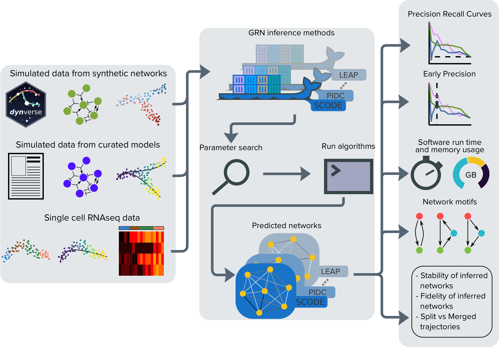

.. BEELINE documentation master file, created by
   sphinx-quickstart on Fri Feb 27 19:31:37 2026.
   You can adapt this file completely to your liking, but it should at least
   contain the root `toctree` directive.

:github_url:  https://github.com/murali-group/Beeline

Welcome to BEELINE's documentation!
===================================

   Overview of BEELINE

This site serves as the documentation for the code released under the
**Benchmarking gEnE reguLatory network Inference from siNgle-cEll
transcriptomic data** (BEELINE) project.  The first part of this
project is the :ref:`BEELINE` pipeline which provides tools to
evaluate the performance of algorithms for the reconstruction of gene
regulatory networks (GRNs) from single-cell RNAseq data. The second
part of this project is :ref:`BoolODE`, a tool to automatically
convert a Boolean model to an ODE model, and subsequently carry out
stochastic simulations.

.. toctree::
   :maxdepth: 2
   :caption: Contents:

   BEELINE
   BoolODE
   modules

Indices and tables
==================

* :ref:`genindex`
* :ref:`modindex`
* :ref:`search`
